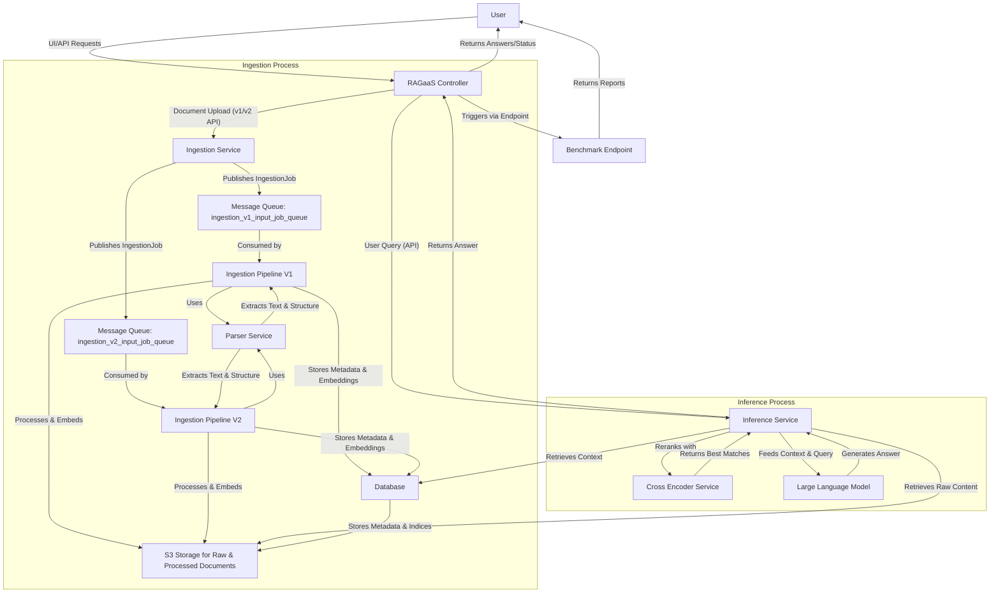

# RAG as a Service (RAGaaS) Microservices Architecture

This document explains the architecture and logic of the RAG as a Service (RAGaaS) platform, designed to provide efficient and scalable Retrieval Augmented Generation capabilities.

## 1. High-Level Overview (For Higher-Level Users)

RAGaaS acts as a smart assistant that can answer your questions by looking up information within your own documents. Imagine having a vast library of documents (such as PDFs or DOCX files) and wanting to ask questions about their content. RAGaaS makes this possible by:

- **Ingesting Documents**: You upload your documents to RAGaaS. The system processes them, understands their content, and stores them in a searchable format. RAGaaS supports different ingestion versions (V1 and V2), which signify different processing pipelines.
- **Organizing Information**: Documents are organized into **Applications** and **Collections**. An Application can be thought of as a project, while a Collection represents a specific set of documents within that project.
- **Answering Questions**: When you ask a question, RAGaaS quickly finds the most relevant information from your documents and uses a powerful language model to generate a precise answer, along with the sources it used.
- **Benchmarking**: RAGaaS includes a built-in tool accessible through its API to evaluate its performance, ensuring consistent accuracy and relevance in its answers.

### Conceptual Flow:

## 2. Core Microservices

The RAGaaS platform is built as a set of interconnected microservices, each responsible for a specific part of the overall functionality.

### 2.1. Component Explanation

- **RAGaaS Controller**:
  This is the central API gateway and orchestrator of the RAGaaS platform. It exposes endpoints for managing applications, collections, documents, handling inference requests, and benchmarking. It coordinates interactions with other microservices to fulfill user requests.
  
   - **Applications Management:** Allows registering new applications in RAGaaS.
   - **Collections Management:** Enables operations such as getting, creating, and deleting collections associated with a specific application.
   - **Documents Management:** Handles document ingestion with separate API endpoints for v1 and v2 document ingestion.
   - **Inference Handling:** Manages answering user questions by proxying requests to the Inference Service.
   - **Benchmarking:** Provides an endpoint to trigger RAG benchmarking and return results in an Excel file directly to users.
- **Ingestion Service**: This service is responsible for processing the documents uploaded to RAGaaS.
     - When a document is uploaded, the Controller publishes an IngestionJob message to a specific **Message Queue**.
     - Distinct queues exist for each ingestion version: ingestion_v1_input_job_queue and ingestion_v2_input_job_queue.  
     - The ingestion pipelines process raw documents through:
       
        - **Downloading the document:** from a temporary location (usually S3).
        - **Parsing:** Dedicated service for extracting text and document structure.
        - **Chunking:** Dividing text into smaller, manageable pieces.
        - **Generating embeddings:** Creating numerical representations for each chunk.
        - **Storage:** Saving processed documents in **S3 Storage** and metadata/embeddings in **Database**.
        
       
- **Inference Service:** When a user asks a question, the Controller forwards the query to the Inference Service.
     - This service first **retrieves relevant context chunks** (and their associated embeddings) from the **Database** based on the user's query.
     - It might also retrieve additional raw document content from **S3 Storage** if needed for specific use cases (e.g., showing original snippets).
     - The retrieved context chunks and the user's query are then fed to a **Large Language Model (LLM)**.
     - The LLM generates an answer based on the provided context.
     - The Inference Service then returns this answer, potentially along with the source context chunks, back to the RAGaaS Controller, which then sends it to the user. The inference_pipeline.py file defines the abstract interface for how this retrieval and generation process should occur.
       
- **Message Queues (MQ):** Enable asynchronous communication between services:
     - Decouple services for independent operation and reliability.
     - Facilitate hand-off of IngestionJob messages.
     - Allow parallel processing and robust error handling.
- **Database & S3 Storage:** These components serve as the persistent storage layer for RAGaaS.
     - The **Database** Stores structured data including application metadata, collection details, document metadata, and embeddings.
     - **S3 Storage**  is used for storing the actual raw document files and potentially processed versions of the documents ( parsed text, chunked data) that are too large or unstructured for the relational database.

- **Benchmarking Service:** Now implemented as a controller endpoint:
      - Accessible directly through RAGaaS API.
      - Tests system performance using predefined metrics.
      - Generates evaluation reports for accuracy and efficiency.                

