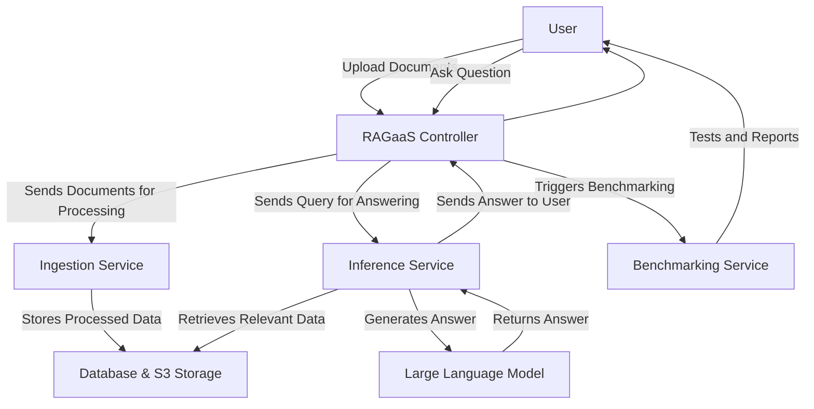

# RAG as a Service (RAGaaS) Microservices Architecture

This document explains the architecture and logic of the RAG as a Service (RAGaaS) platform, designed to provide efficient and scalable Retrieval Augmented Generation capabilities.

## 1. High-Level Overview (For Higher-Level Users)

RAGaaS is like a smart assistant that can answer your questions by looking up information in your own documents. Imagine you have a vast library of documents (PDFs, DOCX, etc.), and you want to ask questions about their content. RAGaaS makes this possible by:

**Ingesting Documents**: You upload your documents to RAGaaS. It processes them, understands their content, and stores them in a way that's easy to search.
**Organizing Information**: Documents are organized into **Applications** and **Collections**. Think of an Application as a project, and a Collection as a specific set of documents within that project.
**Answering Questions**: When you ask a question, RAGaaS quickly finds the most relevant pieces of information from your documents and uses a powerful language model to generate a precise answer, along with the sources it used.
**Benchmarking**: RAGaaS also has a built-in tool to test how well it's performing, ensuring it consistently provides accurate and relevant answers.

### Conceptual Flow:



## 2. Technical Details (For Developers)

The RAGaaS platform is built as a set of interconnected microservices, each responsible for a specific part of the overall functionality.

### 2.1. Core Microservices

Based on the provided openapi specification and configuration, the primary microservices involved are:

- **RAGaaS Controller**: The central API gateway and orchestrator. It exposes endpoints for managing applications, collections, documents, and handling inference requests. It interacts with other microservices to fulfill requests.
  
- **Ingestion Service**: Responsible for processing uploaded documents. This involves parsing the document, chunking its content, generating embeddings, and storing the processed data in a vector database and S3.
  
- **Inference Service:** Handles user queries. It retrieves relevant document chunks based on the query, feeds them to a Large Language Model (LLM), and returns the generated answer, potentially with source information.
  
- **Parser-as-a-Service (Parser-aaS)**: (Inferred from parser_url in config_controller.yml) A dedicated service for parsing various document types (PDF, DOCX, etc.) into a structured format that can be further processed by the Ingestion Service.

### 2.2. Supporting Components

- **Database (PostgreSQL)**: Stores metadata about applications, collections, documents, and their processing status.
- **S3 Storage**: Stores the raw uploaded documents and potentially processed chunks.
- **Message Broker (ActiveMQ/STOMP)**: Used for asynchronous communication between services, especially for ingestion jobs and status updates.
- **Benchmarking Module**: A component (likely part of the Controller or a separate utility) that automates testing of the RAG pipeline's performance.

### 2.3. Detailed Logic and Interactions

#### 2.3.1. RAGaaS Controller (ragaas-controller)

**Purpose**: Acts as the main entry point for external interactions. It manages the lifecycle of applications, collections, and documents, and routes inference requests.

**Key Endpoints (from openapi)**: 

 - ***/v1/applications, /v2/applications***: Register new applications.
 - ***/v1/applications/{app_name}/collections, /v2/applications/{app_name}/collections***: Create, retrieve, and delete collections within an application.
 - ***/v1/applications/{app_name}/collections/{collection_name}/documents, /v2/applications/{app_name}/collections/{collection_name}/documents***: Ingest new documents, retrieve documents.
 - ***/v1/applications/{app_name}/collections/{collection_name}/documents/{document_id}/answer,    /v2/applications/{app_name}/collections/{collection_name}/documents/{document_id}/answer***: Answer questions based on a specific document.
 - ***/v1/applications/{app_name}/collections/{collection_name}/answer, /v2/applications/{app_name}/collections/{collection_name}/answer***: Answer questions based on an entire collection.
 - ***/v1/benchmark/run, /v2/benchmark/run***: Trigger benchmark runs.
   
**Internal Logic**:

 1. Uses ApplicationHandler, CollectionHandler, and DocumentHandler to interact with the database for metadata management.
 2. For document ingestion, it receives the file and metadata, then likely sends a message to the Ingestion Service via the Message Broker or makes a direct API   call.
 3. For inference, it forwards the user's question and context (application, collection, document ID) to the Inference Service.
 4. Handles error responses and validation.

#### 2.3.2. Ingestion Service (ragaas-ingestion-v1)

**Purpose:** Processes raw documents into a searchable format.

   **Flow:** 
      1. Receives a document (e.g., from the Controller via a message queue or direct API call).
      2. Sends the document to the Parser-as-a-Service to extract text and potentially structure.
      3. Chunks the extracted text into smaller, manageable pieces.
      4. Generates vector embeddings for each chunk using an embedding model.
      5. Stores the original document in S3 and the chunks/embeddings in a vector database (not explicitly defined but implied for RAG).
      6. Updates the document's learning status in the central database via the Controller or directly.

#### 2.3.3. Inference Service (ragaas-inference)

**Purpose:** Generates answers to user questions using retrieved information.

   **Flow:** 
   
      1. Receives an InferenceRequest from the Controller (containing the question, chat history, filters, etc.).
      2. Performs a similarity search in the vector database to retrieve the most relevant document chunks based on the current_question and any filters.
      3. Constructs a prompt for the Large Language Model (LLM) by combining the current_question, chat_history, and the retrieved context_chunks.
      4. Sends the prompt to the LLM.
      5. Receives the llm_answer from the LLM.Returns the llm_answer and potentially the context_chunks (sources) back to the Controller.

#### 2.3.4. Benchmarking Module (benchmark.py, benchmarking.py)

**Purpose:** Automates the process of evaluating the RAGaaS system's performance.

   **Components:** 

    1. BenchmarkJob class: Encapsulates the entire benchmarking workflow.
    2. run_benchmark_endpoint (in benchmarking.py): The API endpoint in the Controller that triggers the benchmark.
    
 **Workflow (BenchmarkJob.run_benchmark()):**
 
  1. **Setup Environment:** 

    - Registers a dedicated benchmark application and collection.
    - Crucially: Deletes any existing collection with the same name and its associated documents to ensure a clean slate for each run. This involves monitoring the deletion status of learning documents (JobStatus.IN_PROGRESS, FAILED) before proceeding.

 2. **Ingest Documents:** 
 
   - ***Reads documents from a specified documents_path.***
   - ***Calls the Controller's ingest_document_v2 endpoint for each document.***
   - ***Keeps track of document_id to filename mapping.***

 3. **Monitor Ingestion:** 
 
    - ***Continuously polls the Controller (or directly queries the database) for the learning_status of ingested documents.***
    - ***Waits until all documents are processed (no IN_PROGRESS status).Handles FAILED documents, raising an error if any ingestion fails.***
    - ***Includes a max_wait_minutes timeout to prevent infinite waiting.***

 4. **Run Inference:**
 
    -***Reads a ground_truth_excel file, which contains predefined queries, expected answers, and source documents/pages.***
     ***For each query in the ground truth:***
    
          1. Constructs an InferenceRequest.
          2. Calls either answer_collection (for queries against the whole collection) or answer (for queries against a specific document) on the Controller.
          3. Captures the LLM_Response, LLM_Context_Page, LLM_Context_Docs, and LLM_Context_Data from the inference response.
          4. Logs any errors during inference for a specific query.
   
 6. **Save Results:**
 
    - ***Compiles all query results into a Pandas DataFrame.***
    - ***Saves the results to an Excel file (result_filename), which can then be returned by the run_benchmark_endpoint.***
 
 ### 2.4. Data Flow and Interactions
 
 ```mermaid
 graph TD
     User[User/Client Application] --> |API Calls (REST)| RAGaaSController[RAGaaS Controller]

     subgraph RAGaaS Backend
         RAGaaSController --> |DB Operations| Database[PostgreSQL Database]
         RAGaaSController --> |Document Upload| S3[S3 Storage]
         RAGaaSController --> |Ingestion Job (API/MQ)| IngestionService[Ingestion Service]
         RAGaaSController --> |Inference Request (API)| InferenceService[Inference Service]
         RAGaaSController --> |Benchmark Trigger| BenchmarkingModule[Benchmarking Module]

         IngestionService --> |Parse Request| ParserService[Parser-as-a-Service]
         IngestionService --> |Store Chunks/Embeddings| VectorDB[Vector Database]
         IngestionService --> |Store Raw Document| S3

         InferenceService --> |Retrieve Chunks| VectorDB
         InferenceService --> |Query LLM| LargeLanguageModel[Large Language Model (LLM)]

         BenchmarkingModule --> |Ingest Docs| IngestionService
         BenchmarkingModule --> |Run Queries| InferenceService
         BenchmarkingModule --> |DB Operations| Database
         BenchmarkingModule --> |Generate Report| ExcelFile[Excel Report]
     end

     Database -.-> |Metadata| IngestionService
     Database -.-> |Metadata| InferenceService
     S3 -.-> |Raw Docs| IngestionService
     VectorDB -.-> |Embeddings/Chunks| InferenceService
     LargeLanguageModel -.-> |Answers| InferenceService
     BenchmarkingModule --> |Returns Excel| RAGaaSController
     RAGaaSController --> User

     style RAGaaSController fill:#f9f,stroke:#333,stroke-width:2px
     style IngestionService fill:#bbf,stroke:#333,stroke-width:2px
     style InferenceService fill:#bfb,stroke:#333,stroke-width:2px
     style ParserService fill:#ffb,stroke:#333,stroke-width:2px
     style BenchmarkingModule fill:#fbc,stroke:#333,stroke-width:2px
     style Database fill:#ccf,stroke:#333,stroke-width:2px
     style S3 fill:#cfc,stroke:#333,stroke-width:2px
     style VectorDB fill:#fcf,stroke:#333,stroke-width:2px
     style LargeLanguageModel fill:#cff,stroke:#333,stroke-width:2px
     style ExcelFile fill:#eee,stroke:#333,stroke-width:1px
```


### 2.5. Configuration (config_controller.yml)

This YAML file defines the various configurations for the RAGaaS Controller and its interactions with other services. Key sections include:

- **api:** Defines the controller's service name, version, description, and routing.
- **message_broker:** Configuration for the ActiveMQ message broker (host, port, credentials, SSL).
- **app_queues:** Defines the names of various message queues used for inter-service communication (e.g., ingestion_v1_input_job_queue, job_result_queue, job_error_queue, job_cancellation_topic).
- **db:** Database connection details (username, password, hostname, port, database name, type).
- **inference_url:** The URL for the Inference Service.
- **ingestion_url:** The URL for the Ingestion Service.
- **parser_url:** The URL for the Parser-as-a-Service.
- **s3:** AWS S3 bucket configuration (name, region, base path).
- **benchmark:** Specific settings for the benchmarking module, including:
    -   ***app_name, collection_name:*** Names for the benchmark application and collection.
    -   ***documents_path:*** Path to the documents used for benchmarking.
    -   ***ground_truth_excel:*** Path to the Excel file containing ground truth queries and answers.
    -   ***poll_interval, max_wait_minutes:*** Parameters for monitoring ingestion status.
    -   ***result_filename, log_filename, report_filename:*** Output file names for benchmark results and logs.This architecture provides a robust and scalable solution for building RAG-powered applications, separating concerns into distinct microservices for better maintainability, scalability, and fault tolerance.
