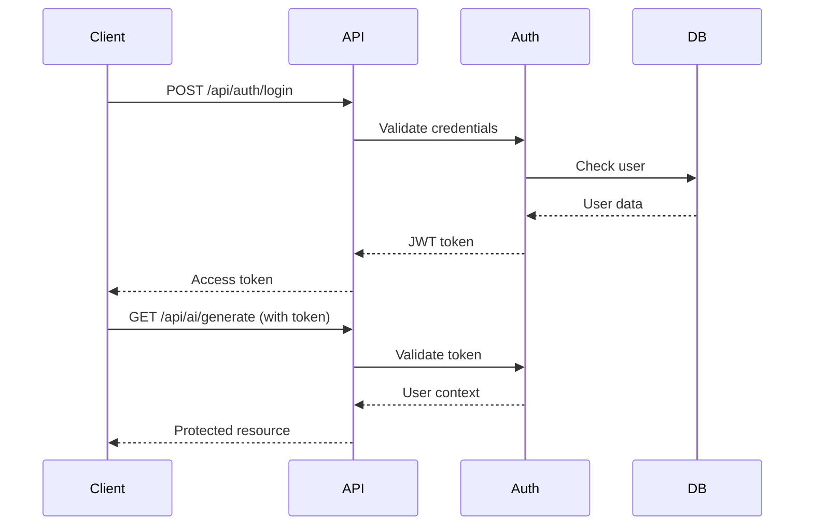

# 📚 AI-Assisted Coding Environment Documentation

Welcome to the comprehensive documentation for the AI-Assisted Coding Environment. This guide will help you understand, deploy, and extend the platform.

## 📋 Table of Contents

1. [Getting Started](#getting-started)
2. [Architecture Overview](#architecture-overview)
3. [API Documentation](#api-documentation)
4. [Deployment Guide](#deployment-guide)
5. [Development Guide](#development-guide)
6. [AI Provider Integration](#ai-provider-integration)
7. [Security & Authentication](#security--authentication)
8. [Performance Optimization](#performance-optimization)
9. [Troubleshooting](#troubleshooting)
10. [FAQ](#faq)

## 🚀 Getting Started

### System Requirements

**Minimum Requirements:**
- Python 3.8+
- 2GB RAM
- 1GB storage space
- Internet connection for AI providers

**Recommended Requirements:**
- Python 3.10+
- 8GB RAM
- 10GB storage space
- Redis server
- PostgreSQL database

### Installation Methods

#### Method 1: Direct Installation
```bash
git clone https://github.com/karimosman89/AI-Assisted-Coding-Env.git
cd AI-Assisted-Coding-Env
python -m venv venv
source venv/bin/activate
pip install -r requirements.txt
python run.py create-env
# Edit .env file with your configurations
python run.py dev
```

#### Method 2: Docker Installation
```bash
git clone https://github.com/karimosman89/AI-Assisted-Coding-Env.git
cd AI-Assisted-Coding-Env
docker-compose up -d
```

#### Method 3: One-Click Deploy
[](https://heroku.com/deploy)

## 🏗️ Architecture Overview

### System Components

The AI-Assisted Coding Environment follows a microservices-inspired architecture:

```
┌─────────────────────────────────────────────────────────────┐
│                    Frontend Layer                           │
│  ┌─────────────┐  ┌─────────────┐  ┌─────────────────────┐ │
│  │   Monaco    │  │  Tailwind   │  │   WebSocket         │ │
│  │   Editor    │  │    CSS      │  │   Client            │ │
│  └─────────────┘  └─────────────┘  └─────────────────────┘ │
└─────────────────────────────────────────────────────────────┘
                                │
┌─────────────────────────────────────────────────────────────┐
│                     API Layer                               │
│  ┌─────────────┐  ┌─────────────┐  ┌─────────────────────┐ │
│  │   FastAPI   │  │  WebSocket  │  │   Authentication    │ │
│  │   Routes    │  │   Handler   │  │   Middleware        │ │
│  └─────────────┘  └─────────────┘  └─────────────────────┘ │
└─────────────────────────────────────────────────────────────┘
                                │
┌─────────────────────────────────────────────────────────────┐
│                   Business Logic Layer                      │
│  ┌─────────────┐  ┌─────────────┐  ┌─────────────────────┐ │
│  │  AI Engine  │  │ Rate Limiter│  │  Configuration      │ │
│  │  Multi-Prov │  │ & Security  │  │  Management         │ │
│  └─────────────┘  └─────────────┘  └─────────────────────┘ │
└─────────────────────────────────────────────────────────────┘
                                │
┌─────────────────────────────────────────────────────────────┐
│                   Data Layer                                │
│  ┌─────────────┐  ┌─────────────┐  ┌─────────────────────┐ │
│  │   Database  │  │    Redis    │  │   AI Provider       │ │
│  │ (PostgreSQL)│  │   Cache     │  │   APIs              │ │
│  └─────────────┘  └─────────────┘  └─────────────────────┘ │
└─────────────────────────────────────────────────────────────┘
```

### Key Design Principles

1. **Modularity**: Each component is independent and replaceable
2. **Scalability**: Horizontal scaling support with load balancers
3. **Reliability**: Intelligent fallback mechanisms for AI providers
4. **Security**: Multi-layer security with authentication and rate limiting
5. **Performance**: Async operations and efficient caching strategies

## 📡 API Documentation

### Authentication Flow



### Core API Endpoints

#### AI Generation Endpoints
```http
POST /api/ai/generate
POST /api/ai/complete
POST /api/ai/analyze
POST /api/ai/refactor
POST /api/ai/document
```

#### Authentication Endpoints
```http
POST /api/auth/login
POST /api/auth/register
GET  /api/auth/me
POST /api/auth/logout
```

#### Health & Monitoring
```http
GET /api/health
GET /api/ai/health
GET /api/metrics
GET /api/status
```

### WebSocket Events

#### Client to Server
```javascript
// Join collaboration room
{
  "type": "join_room",
  "data": { "room_id": "room_123" }
}

// Real-time code completion
{
  "type": "ai_complete",
  "data": { 
    "content": "def hello_",
    "language": "python"
  }
}

// Share code changes
{
  "type": "code_change",
  "data": {
    "room_id": "room_123",
    "changes": [...]
  }
}
```

#### Server to Client
```javascript
// AI completion result
{
  "type": "ai_completion_result",
  "data": {
    "content": "world():\n    print('Hello, World!')",
    "provider": "openai"
  }
}

// Collaboration update
{
  "type": "code_update",
  "data": {
    "user_id": "user_456",
    "changes": [...],
    "timestamp": 1640995200000
  }
}
```

## 🚀 Deployment Guide

### Production Deployment Checklist

- [ ] Set strong secret keys and passwords
- [ ] Configure HTTPS with valid SSL certificates
- [ ] Set up proper database with backups
- [ ] Configure Redis for production
- [ ] Set appropriate environment variables
- [ ] Enable monitoring and logging
- [ ] Set up reverse proxy (Nginx)
- [ ] Configure auto-scaling rules
- [ ] Test disaster recovery procedures

### Docker Production Deployment

```dockerfile
# Multi-stage build for optimization
FROM python:3.11-slim as builder
WORKDIR /app
COPY requirements.txt .
RUN pip install --user -r requirements.txt

FROM python:3.11-slim
WORKDIR /app
COPY --from=builder /root/.local /root/.local
COPY . .

# Security: Run as non-root user
RUN useradd --create-home --shell /bin/bash app
USER app

ENV PATH=/root/.local/bin:$PATH
EXPOSE 8000

CMD ["python", "run.py", "server"]
```

### Kubernetes Production Setup

```yaml
apiVersion: v1
kind: ConfigMap
metadata:
  name: ai-coding-env-config
data:
  ENVIRONMENT: "production"
  LOG_LEVEL: "INFO"
  WORKERS: "4"

---
apiVersion: v1
kind: Secret
metadata:
  name: ai-coding-env-secrets
type: Opaque
data:
  SECRET_KEY: <base64-encoded-secret>
  OPENAI_API_KEY: <base64-encoded-key>
  DATABASE_URL: <base64-encoded-url>

---
apiVersion: apps/v1
kind: Deployment
metadata:
  name: ai-coding-env
spec:
  replicas: 3
  selector:
    matchLabels:
      app: ai-coding-env
  template:
    metadata:
      labels:
        app: ai-coding-env
    spec:
      containers:
      - name: ai-coding-env
        image: ai-coding-env:latest
        ports:
        - containerPort: 8000
        envFrom:
        - configMapRef:
            name: ai-coding-env-config
        - secretRef:
            name: ai-coding-env-secrets
        resources:
          requests:
            memory: "512Mi"
            cpu: "250m"
          limits:
            memory: "2Gi"
            cpu: "1000m"
        livenessProbe:
          httpGet:
            path: /api/health/live
            port: 8000
          initialDelaySeconds: 30
          periodSeconds: 10
        readinessProbe:
          httpGet:
            path: /api/health/ready
            port: 8000
          initialDelaySeconds: 5
          periodSeconds: 5

---
apiVersion: v1
kind: Service
metadata:
  name: ai-coding-env-service
spec:
  selector:
    app: ai-coding-env
  ports:
  - port: 80
    targetPort: 8000
  type: LoadBalancer
```

## 💻 Development Guide

### Setting Up Development Environment

1. **Clone and Setup**
```bash
git clone https://github.com/karimosman89/AI-Assisted-Coding-Env.git
cd AI-Assisted-Coding-Env
python -m venv venv
source venv/bin/activate
pip install -r requirements.txt
pip install -r requirements-dev.txt
```

2. **Pre-commit Hooks**
```bash
pre-commit install
```

3. **Environment Configuration**
```bash
python run.py create-env
# Edit .env with development settings
```

### Code Structure

```
src/
├── core/
│   ├── config.py          # Configuration management
│   └── ai_engine.py       # Multi-provider AI engine
├── api/
│   ├── server.py          # FastAPI application
│   ├── routes/            # API endpoints
│   └── middleware/        # Custom middleware
├── models/                # Data models
├── utils/                 # Utility functions
└── templates/             # HTML templates
```

### Adding New AI Provider

1. **Create Provider Client**
```python
# src/core/providers/new_provider.py
class NewProviderClient:
    def __init__(self, api_key: str, **kwargs):
        self.api_key = api_key
        self.config = kwargs
    
    async def complete_code(self, request: AIRequest) -> AIResponse:
        # Implementation here
        pass
```

2. **Register in AI Engine**
```python
# src/core/ai_engine.py
def initialize_clients(self):
    # ... existing providers
    
    if settings.new_provider.api_key:
        self.clients[AIProvider.NEW_PROVIDER] = NewProviderClient(
            api_key=settings.new_provider.api_key,
            **settings.new_provider.config
        )
```

3. **Add Configuration**
```python
# src/core/config.py
class AIProviderConfig(BaseSettings):
    # ... existing providers
    
    new_provider_api_key: Optional[str] = Field(default=None, env="NEW_PROVIDER_API_KEY")
    new_provider_model: str = Field(default="default-model", env="NEW_PROVIDER_MODEL")
```

### Testing Guidelines

```python
# tests/test_ai_engine.py
import pytest
from src.core.ai_engine import AIEngine, AIRequest, TaskType

@pytest.mark.asyncio
async def test_code_completion():
    engine = AIEngine()
    request = AIRequest(
        task_type=TaskType.CODE_COMPLETION,
        content="def hello_",
        language="python"
    )
    
    response = await engine.complete_code(request.content, request.language)
    
    assert response.success
    assert "world" in response.content.lower()
```

### Performance Testing

```python
# tests/test_performance.py
import asyncio
import time
from src.core.ai_engine import ai_engine

async def test_concurrent_requests():
    tasks = []
    start_time = time.time()
    
    for i in range(10):
        task = ai_engine.complete_code(f"def function_{i}", "python")
        tasks.append(task)
    
    results = await asyncio.gather(*tasks)
    end_time = time.time()
    
    assert all(result.success for result in results)
    assert end_time - start_time < 30  # Should complete within 30 seconds
```

## 🤖 AI Provider Integration

### Provider Comparison

| Provider | Strengths | Best Use Cases | Rate Limits |
|----------|-----------|----------------|-------------|
| OpenAI GPT-4 | Natural language understanding | General coding, documentation | 40K tokens/min |
| Anthropic Claude | Safety, reasoning | Code review, security analysis | 20K tokens/min |
| Google Gemini | Multimodal capabilities | Complex analysis, integration | 30K tokens/min |

### Configuration Best Practices

1. **Provider Priority**
```env
PRIMARY_AI_PROVIDER="openai"
FALLBACK_AI_PROVIDERS=["anthropic", "google"]
```

2. **Rate Limiting Strategy**
```env
AI_REQUESTS_PER_MINUTE=60
AI_MAX_CONCURRENT_REQUESTS=5
```

3. **Cost Optimization**
```env
# Use cheaper models for simple tasks
OPENAI_COMPLETION_MODEL="gpt-3.5-turbo"
OPENAI_GENERATION_MODEL="gpt-4"
```

### Custom Provider Integration

```python
class CustomAIProvider:
    def __init__(self, config):
        self.config = config
    
    async def complete_code(self, request):
        # Your custom implementation
        return AIResponse(
            success=True,
            content="Generated completion",
            provider="custom",
            model="custom-model"
        )
    
    async def generate_code(self, request):
        # Your custom implementation
        pass
    
    async def analyze_code(self, request):
        # Your custom implementation
        pass
```

## 🔒 Security & Authentication

### Security Features

1. **JWT Authentication**: Secure token-based authentication
2. **Rate Limiting**: Prevent API abuse and DoS attacks
3. **Input Validation**: Sanitize all user inputs
4. **CORS Configuration**: Control cross-origin requests
5. **SQL Injection Prevention**: Use parameterized queries
6. **XSS Protection**: Escape user-generated content

### Authentication Flow

```python
from fastapi import Depends, HTTPException
from src.api.routes.auth import get_current_active_user

@router.post("/protected-endpoint")
async def protected_endpoint(
    current_user: dict = Depends(get_current_active_user)
):
    # Only authenticated users can access this
    return {"message": f"Hello {current_user['email']}"}
```

### Security Headers

```python
# Automatic security headers
@app.middleware("http")
async def add_security_headers(request: Request, call_next):
    response = await call_next(request)
    response.headers["X-Content-Type-Options"] = "nosniff"
    response.headers["X-Frame-Options"] = "DENY"
    response.headers["X-XSS-Protection"] = "1; mode=block"
    response.headers["Strict-Transport-Security"] = "max-age=31536000; includeSubDomains"
    return response
```

## ⚡ Performance Optimization

### Database Optimization

```python
# Connection pooling
DATABASE_CONFIG = {
    "pool_size": 20,
    "max_overflow": 40,
    "pool_timeout": 30,
    "pool_recycle": 3600
}

# Query optimization
async def get_user_with_cache(user_id: int):
    # Try cache first
    cached_user = await redis.get(f"user:{user_id}")
    if cached_user:
        return json.loads(cached_user)
    
    # Fallback to database
    user = await db.fetch_one("SELECT * FROM users WHERE id = :id", {"id": user_id})
    
    # Cache for 1 hour
    await redis.setex(f"user:{user_id}", 3600, json.dumps(user))
    return user
```

### Caching Strategy

```python
# Redis caching for AI responses
async def cached_ai_request(content: str, provider: str) -> str:
    cache_key = f"ai:{provider}:{hashlib.md5(content.encode()).hexdigest()}"
    
    # Check cache
    cached_result = await redis.get(cache_key)
    if cached_result:
        return cached_result
    
    # Generate new result
    result = await ai_engine.generate_code(content)
    
    # Cache for 24 hours
    await redis.setex(cache_key, 86400, result.content)
    
    return result.content
```

### Monitoring & Metrics

```python
import time
from prometheus_client import Counter, Histogram

REQUEST_COUNT = Counter('http_requests_total', 'Total HTTP requests', ['method', 'endpoint', 'status'])
REQUEST_DURATION = Histogram('http_request_duration_seconds', 'HTTP request duration')

@app.middleware("http")
async def metrics_middleware(request: Request, call_next):
    start_time = time.time()
    
    response = await call_next(request)
    
    REQUEST_COUNT.labels(
        method=request.method,
        endpoint=request.url.path,
        status=response.status_code
    ).inc()
    
    REQUEST_DURATION.observe(time.time() - start_time)
    
    return response
```

## 🔧 Troubleshooting

### Common Issues

#### 1. AI Provider Connection Issues
```bash
# Check API key validity
python run.py health

# Test specific provider
curl -X POST "http://localhost:8000/api/ai/health"
```

#### 2. Database Connection Problems
```bash
# Verify database URL
python -c "from src.core.config import settings; print(settings.database.database_url)"

# Test connection
python -c "import asyncpg; asyncio.run(asyncpg.connect('your_db_url'))"
```

#### 3. WebSocket Connection Failures
```javascript
// Debug WebSocket in browser
const ws = new WebSocket('ws://localhost:8000/ws/coding/test');
ws.onopen = () => console.log('Connected');
ws.onerror = (error) => console.error('WebSocket error:', error);
ws.onclose = (event) => console.log('Disconnected:', event.code, event.reason);
```

#### 4. High Memory Usage
```bash
# Monitor memory usage
python -m memory_profiler run.py dev

# Optimize AI engine
# Reduce concurrent requests
AI_MAX_CONCURRENT_REQUESTS=2
```

### Debug Mode

```env
DEBUG=true
LOG_LEVEL="DEBUG"
```

### Performance Profiling

```python
import cProfile
import pstats

def profile_ai_request():
    profiler = cProfile.Profile()
    profiler.enable()
    
    # Your code here
    result = await ai_engine.generate_code("Hello world")
    
    profiler.disable()
    stats = pstats.Stats(profiler)
    stats.sort_stats('cumulative').print_stats(10)
```

## ❓ FAQ

### General Questions

**Q: Which AI providers are supported?**
A: Currently supports OpenAI GPT-4, Anthropic Claude, and Google Gemini with intelligent fallback between providers.

**Q: Can I use this without an internet connection?**
A: No, AI providers require internet connectivity. However, you can use the editor and collaboration features offline.

**Q: Is there a rate limit for AI requests?**
A: Yes, configurable rate limits protect against abuse while ensuring fair usage across users.

### Technical Questions

**Q: How do I add a new programming language?**
A: Add the language to the Monaco editor configuration and update the AI prompts to handle the new language syntax.

**Q: Can I deploy this on a serverless platform?**
A: Yes, but WebSocket functionality may be limited. Consider using serverless WebSockets or polling for real-time features.

**Q: How do I backup user data?**
A: Use standard database backup procedures for PostgreSQL/SQLite and implement regular automated backups.

### Security Questions

**Q: How secure are my API keys?**
A: API keys are stored as environment variables and never logged or exposed. Use proper secret management in production.

**Q: Is code data encrypted?**
A: Code in transit is encrypted via HTTPS. For data at rest encryption, configure your database accordingly.

**Q: Can I run this in an air-gapped environment?**
A: Not fully, as AI providers require external API access. Consider using local AI models for air-gapped deployments.

---

For more specific questions, please check our [GitHub Issues](https://github.com/karimosman89/AI-Assisted-Coding-Env/issues) or create a new discussion.